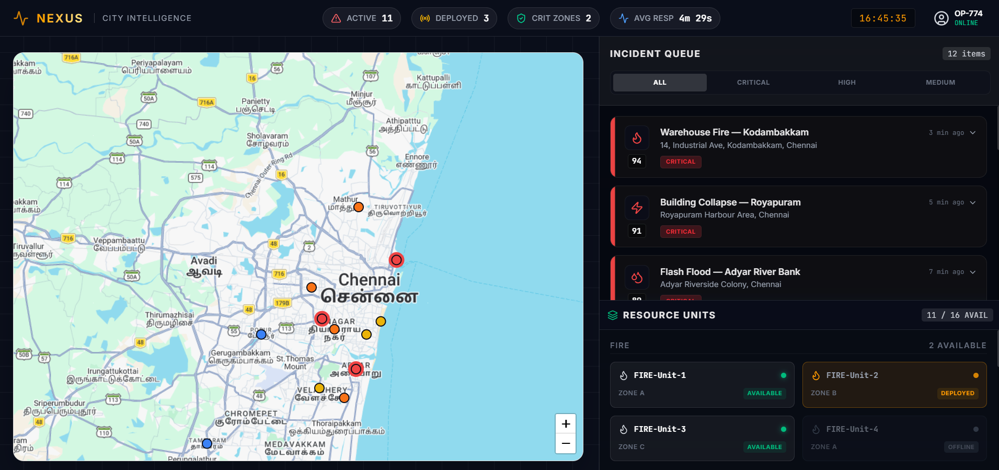
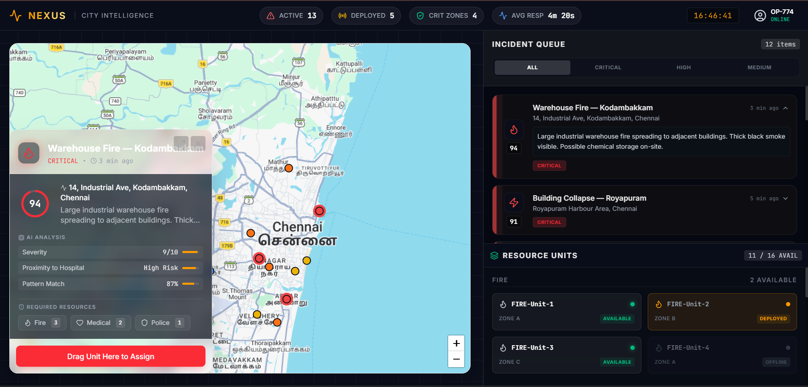
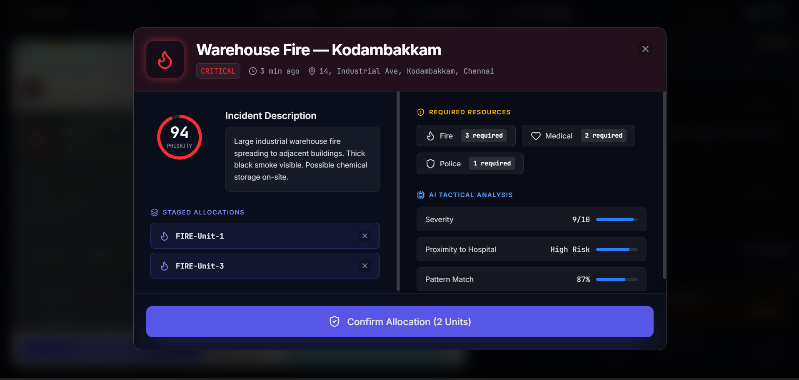
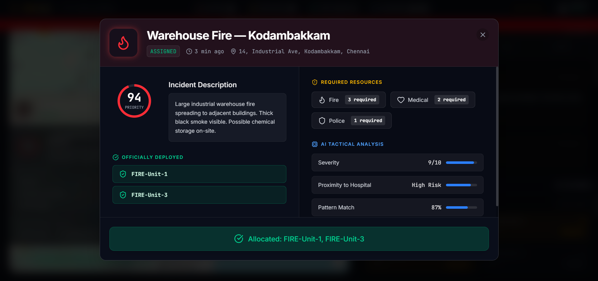

<div align="center">

```
███╗   ██╗███████╗██╗  ██╗██╗   ██╗███████╗
████╗  ██║██╔════╝╚██╗██╔╝██║   ██║██╔════╝
██╔██╗ ██║█████╗   ╚███╔╝ ██║   ██║███████╗
██║╚██╗██║██╔══╝   ██╔██╗ ██║   ██║╚════██║
██║ ╚████║███████╗██╔╝ ██╗╚██████╔╝███████║
╚═╝  ╚═══╝╚══════╝╚═╝  ╚═╝ ╚═════╝ ╚══════╝
```

# NEXUS — City Intelligence Response System

**A decision-support platform for city administrators and emergency response teams**  
*Prioritize smarter. Respond faster. Save lives.*

---


---


# Prototype Images






> *"The right resource. The right place. Right now."*

</div>

---

## 🧭 Table of Contents

- [The Problem](#-the-problem)
- [The Solution](#-the-solution)
- [Key Features](#-key-features)
- [System Architecture](#-system-architecture)
- [Tech Stack](#-tech-stack)
- [Database Schema](#-database-schema)
- [Project Structure](#-project-structure)
- [Getting Started](#-getting-started)
- [API Reference](#-api-reference)
- [Innovation Highlights](#-innovation-highlights)
- [Team](#-team)

---

## 🚨 The Problem

City emergency response teams face a critical gap every single day:

- **Too many incidents, not enough visibility** — dispatchers juggle calls, spreadsheets, and radio channels simultaneously
- **No intelligent prioritization** — every incident feels urgent; knowing which one truly is life-or-death takes precious minutes
- **Resource blind spots** — teams don't know in real time which units are available, where they are, or what's already deployed
- **No decision audit trail** — when things go wrong, there's no record of what was decided, when, and why

Every 60 seconds of delayed response in a cardiac emergency drops survival odds by 10%. In a building collapse, the window is 6 hours. **The stakes are not abstract.**

---

## 💡 The Solution

**NEXUS** is a real-time decision-support command center — not a full automation system, but an intelligent co-pilot that helps human commanders make faster, better-informed decisions.

```
Incident Reported  →  AI Scores Priority  →  Commander Sees WHY  →  Resource Assigned  →  Life Saved
```

NEXUS puts everything on one screen: a live heatmap of active incidents, an AI-ranked incident queue, draggable resource allocation, and transparent reasoning behind every recommendation — so commanders act with confidence, not guesswork.

---

## ✨ Key Features

### 🗺️ Live Incident Heatmap
Real-time Leaflet.js map with heatmap overlay showing incident density across the city. Color-coded markers (critical → red pulse, high → orange, medium → yellow, low → blue) give commanders instant spatial awareness.

### 🧠 AI Priority Scoring with Transparent Reasoning
Every incident receives a dynamic priority score (0–100) computed from severity, proximity to vulnerable zones, resource availability, and historical pattern matching. Unlike black-box AI — NEXUS shows its reasoning:

```
📍 Proximity to Hospital: High  ·  ⚡ Severity: 9/10  ·  🔁 Pattern Match: 87%
```

### 🎯 Drag-and-Drop Resource Allocation
Dispatchers drag resource unit cards (Fire, Medical, Police, HAZMAT, Rescue) directly onto incident cards to assign them. The system instantly updates unit status, calculates ETA, and fires a confirmation toast.

### ⚠️ Cascading Risk Alerts
When a new critical incident occurs near existing incidents sharing resources, NEXUS recalculates risk scores for all affected incidents — reflecting real-world compound emergencies.

### 🛡️ Conflict & Depletion Warnings
Before a commander depletes the last available unit in a zone, NEXUS fires a warning:
> *"⚠ Last available MEDICAL unit deployed — Zone 4 now uncovered"*

### 📋 Live Situation Board
A top-bar command strip shows live-updating city-wide stats: active incidents, units deployed, critical zones, and average response time — all fluctuating in real time.

---

## 🏗️ System Architecture

```
┌─────────────────────────────────────────────────────────────┐
│                        NEXUS FRONTEND                        │
│                    React + Tailwind CSS                      │
│                                                             │
│  ┌─────────────┐  ┌──────────────┐  ┌───────────────────┐  │
│  │   MapPanel  │  │IncidentQueue │  │  ResourceBoard    │  │
│  │  (Leaflet)  │  │  + Filters   │  │  (Drag & Drop)    │  │
│  └─────────────┘  └──────────────┘  └───────────────────┘  │
└────────────────────────────┬────────────────────────────────┘
                             │ REST API (JSON)
┌────────────────────────────▼────────────────────────────────┐
│                      DJANGO BACKEND                          │
│                                                             │
│  ┌──────────────┐  ┌──────────────┐  ┌──────────────────┐  │
│  │  Incidents   │  │  Resources   │  │  AI Priority     │  │
│  │    API       │  │    API       │  │  Scoring Engine  │  │
│  └──────────────┘  └──────────────┘  └──────────────────┘  │
│                                                             │
│  ┌──────────────┐  ┌──────────────┐  ┌──────────────────┐  │
│  │ Assignments  │  │ Activity Log │  │  WebSocket       │  │
│  │    API       │  │    API       │  │  (Live Updates)  │  │
│  └──────────────┘  └──────────────┘  └──────────────────┘  │
└────────────────────────────┬────────────────────────────────┘
                             │ Supabase Client
┌────────────────────────────▼────────────────────────────────┐
│                      SUPABASE DATABASE                       │
│                      (PostgreSQL)                           │
│                                                             │
│   incidents  ·  resources  ·  assignments  ·  zones        │
│   users  ·  ai_recommendations  ·  activity_log            │
└─────────────────────────────────────────────────────────────┘
```

---

## 🛠️ Tech Stack

| Layer | Technology | Purpose |
|---|---|---|
| **Frontend** | React 18 + Vite | Component-based SPA |
| **Styling** | Tailwind CSS | Utility-first dark UI |
| **Map** | Leaflet.js + Leaflet.heat | Live incident heatmap |
| **Icons** | Lucide React | Consistent icon system |
| **Backend** | Django 4.2 + DRF | REST API + business logic |
| **Database** | Supabase (PostgreSQL) | Realtime database + auth |
| **Realtime** | Supabase Realtime | Live incident push updates |
| **Auth** | Supabase Auth | Role-based access (commander / dispatcher) |
| **AI Scoring** | Python scoring engine | Priority calculation algorithm |

---

## 🗄️ Database Schema

### Core Tables

```sql
-- Incidents reported across the city
incidents (id, title, description, type, status, severity,
           priority_score, latitude, longitude, zone_id,
           reported_by, created_at, resolved_at)

-- Emergency response units
resources (id, name, type, status, zone_id,
           latitude, longitude, eta_minutes, last_active)

-- Human assignment decisions (full audit trail)
assignments (id, incident_id, resource_id, assigned_by,
             assigned_at, arrived_at, completed_at, status)

-- City geographic zones
zones (id, name, risk_level, population,
       boundary, active_incidents, available_units)

-- AI recommendation snapshots (auditable)
ai_recommendations (id, incident_id, recommended_resources,
                    risk_if_delayed, reasoning, confidence_score,
                    similar_incidents, generated_at)

-- Every commander action logged
activity_log (id, user_id, incident_id, action,
              details, created_at)
```

### Incident Types & Statuses

```
Types:    fire | flood | medical | crime | hazmat | infrastructure
Statuses: incoming | active | assigned | resolved | escalated
Priority: CRITICAL (80–100) | HIGH (60–79) | MEDIUM (40–59) | LOW (0–39)
```

---

## 📁 Project Structure

```
nexus/
│
├── frontend/                        # React application
│   ├── src/
│   │   ├── App.jsx                  # Root — global state & handlers
│   │   ├── components/
│   │   │   ├── TopBar.jsx           # Live stats + clock + operator
│   │   │   ├── MapPanel.jsx         # Leaflet map + heatmap + markers
│   │   │   ├── IncidentDetailOverlay.jsx  # Slide-up incident detail
│   │   │   ├── IncidentSidebar.jsx  # Right panel container
│   │   │   ├── IncidentQueue.jsx    # Filtered & sorted incident list
│   │   │   ├── IncidentCard.jsx     # Individual card (drop target)
│   │   │   ├── ResourceBoard.jsx    # Resource unit grid
│   │   │   ├── ResourceCard.jsx     # Draggable unit card
│   │   │   └── ToastNotification.jsx  # Assignment confirmation
│   │   ├── data/
│   │   │   ├── incidents.js         # Dummy incident seed data
│   │   │   └── resources.js         # Dummy resource seed data
│   │   ├── hooks/
│   │   │   ├── useLiveClock.js      # Real-time clock hook
│   │   │   └── useLiveStats.js      # Fluctuating stat counters
│   │   └── utils/
│   │       └── priorityHelpers.js   # Score colors, labels, icons
│   ├── package.json
│   └── vite.config.js
│
├── backend/                         # Django application
│   ├── nexus/
│   │   ├── settings.py
│   │   ├── urls.py
│   │   └── wsgi.py
│   ├── incidents/
│   │   ├── models.py
│   │   ├── views.py
│   │   ├── serializers.py
│   │   └── urls.py
│   ├── resources/
│   │   ├── models.py
│   │   ├── views.py
│   │   └── serializers.py
│   ├── assignments/
│   │   ├── models.py
│   │   ├── views.py
│   │   └── serializers.py
│   ├── scoring/
│   │   └── engine.py                # AI priority scoring logic
│   ├── requirements.txt
│   └── manage.py
│
└── README.md
```

---

## 🚀 Getting Started

### Prerequisites

```bash
node >= 18.0.0
python >= 3.10
pip
npm or yarn
```

### 1. Clone the Repository

```bash
git clone https://github.com/your-org/nexus-response-system.git
cd nexus-response-system
```

### 2. Backend Setup (Django)

```bash
cd backend

# Create virtual environment
python -m venv venv
source venv/bin/activate        # Windows: venv\Scripts\activate

# Install dependencies
pip install -r requirements.txt

# Set environment variables
cp .env.example .env
# Edit .env with your Supabase credentials

# Run migrations
python manage.py migrate

# Seed dummy data
python manage.py loaddata fixtures/incidents.json
python manage.py loaddata fixtures/resources.json

# Start server
python manage.py runserver
```

### 3. Frontend Setup (React)

```bash
cd frontend

# Install dependencies
npm install

# Set environment variables
cp .env.example .env
# Edit .env — set VITE_API_BASE_URL=http://localhost:8000

# Start dev server
npm run dev
```

### 4. Environment Variables

**Backend `.env`**
```env
SUPABASE_URL=https://your-project.supabase.co
SUPABASE_KEY=your-anon-key
SUPABASE_SERVICE_KEY=your-service-key
SECRET_KEY=your-django-secret-key
DEBUG=True
ALLOWED_HOSTS=localhost,127.0.0.1
```

**Frontend `.env`**
```env
VITE_API_BASE_URL=http://localhost:8000/api
VITE_SUPABASE_URL=https://your-project.supabase.co
VITE_SUPABASE_ANON_KEY=your-anon-key
```

### 5. Open the App

```
Frontend:  http://localhost:5173
Backend:   http://localhost:8000
API Docs:  http://localhost:8000/api/docs
```

---

## 📡 API Reference

### Incidents

| Method | Endpoint | Description |
|---|---|---|
| `GET` | `/api/incidents/` | List all incidents, sorted by priority |
| `GET` | `/api/incidents/:id/` | Get single incident with AI recommendation |
| `POST` | `/api/incidents/` | Report new incident |
| `PATCH` | `/api/incidents/:id/` | Update incident status |
| `GET` | `/api/incidents/active/` | Live active incidents only |

### Resources

| Method | Endpoint | Description |
|---|---|---|
| `GET` | `/api/resources/` | List all units with current status |
| `GET` | `/api/resources/available/` | Available units only |
| `PATCH` | `/api/resources/:id/status/` | Update unit status |

### Assignments

| Method | Endpoint | Description |
|---|---|---|
| `POST` | `/api/assignments/` | Assign resource to incident |
| `GET` | `/api/assignments/:incident_id/` | Get all assignments for incident |
| `PATCH` | `/api/assignments/:id/complete/` | Mark assignment complete |

### Zones

| Method | Endpoint | Description |
|---|---|---|
| `GET` | `/api/zones/` | All zones with live stats |
| `GET` | `/api/zones/:id/risk/` | Zone risk assessment |

---

## 💎 Innovation Highlights

### 1. Cascading Risk Recalculation
When a new incident is reported, the scoring engine recalculates priority for all neighboring incidents within the same zone — because a fire + flood sharing the same medical resources is a fundamentally different situation than each in isolation.

### 2. Confidence Transparency
Every AI recommendation exposes its reasoning as structured chips — not just a score, but *why* that score. This directly supports informed human decision-making without black-box automation.

### 3. Full Decision Audit Trail
Every commander action (assignment, escalation, dismissal) is written to `activity_log` with a full JSON snapshot of the system state at that moment. Post-incident review becomes a precise timeline.

### 4. Conflict & Depletion Warnings
Zone-level resource depletion is tracked in real time. Assigning the last available unit in a zone triggers an immediate warning, preventing a well-intentioned assignment from creating a dangerous coverage gap elsewhere.

### 5. Human-in-the-Loop by Design
NEXUS never auto-assigns, auto-escalates, or takes action without explicit commander confirmation. The AI ranks and recommends. Humans decide. This is intentional — accountability cannot be delegated to an algorithm.

---

## 👥 Team

Built with precision and purpose for the **Smart Response & Resource Coordination** challenge.

| Name | Role |
|---|---|
| — | Frontend Lead (React + Map) |
| — | Backend Lead (Django + API) |
| — | Database & Infrastructure (Supabase) |
| — | AI Scoring Engine & UX |

---

<div align="center">

**NEXUS** — Built for commanders who don't have time to guess.

*The right resource. The right place. Right now.*

---

⭐ Star this repo if NEXUS impressed you

</div>